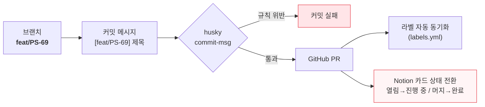
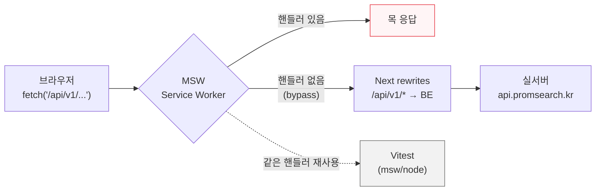
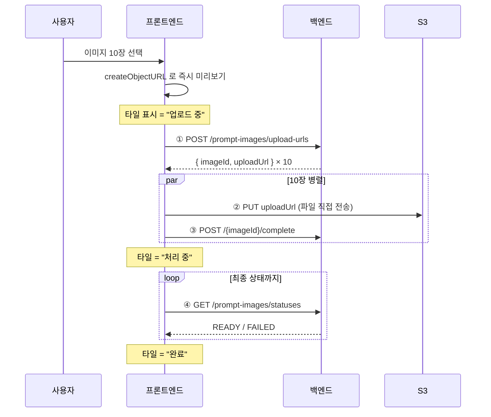
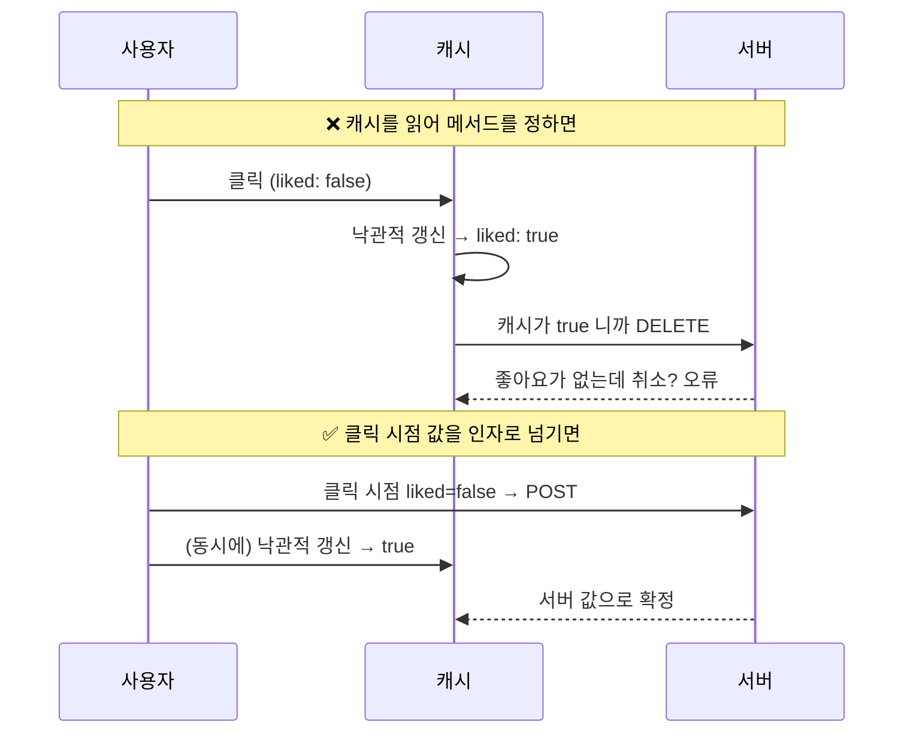
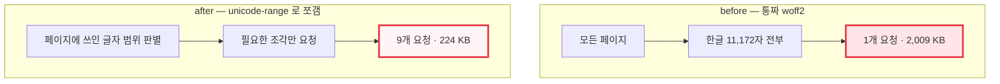

# 최종 발표 — 프론트엔드

> 발표용 슬라이드 초안. 각 슬라이드마다 **핵심 메시지 → 내용 → 필요한 시각자료**를 적어 뒀다.
> 다이어그램은 mermaid 로 그려 뒀으니 GitHub 에서 렌더된 걸 캡처해 PPT 에 넣으면 된다.
> 스크린샷이 필요한 항목은 [직접 찍어야 하는 것](#직접-찍어야-하는-것) 에 모아 뒀다.

---

## 슬라이드 1 — 역할 분배

**핵심 메시지: 2명이라 화면 단위로 세로로 잘랐다. 대신 공통 레이어를 먼저 합의하고 시작했다.**

|           | **조혜원**                                  | **김채민**                              |
| --------- | ------------------------------------------- | --------------------------------------- |
| 담당 화면 | 홈 갤러리 · 프롬프트 상세 · 업로드 · 관리자 | 로그인 · 회원가입 · 온보딩 · 마이페이지 |
| 성격      | 콘텐츠 소비/생산 플로우                     | 인증 · 계정 플로우                      |

**공통 인프라는 나눠 맡지 않고 먼저 합의했다** — 디자인 토큰, API 클라이언트, MSW 목 서버, 테스트 환경.

> 말할 것: "화면이 달라도 코드 모양이 같습니다. 상대 코드를 읽는 비용이 거의 없었어요."

**시각자료**: 표 그대로. 화면 캡처를 좌우로 배치하면 더 좋음(→ 스크린샷 ①)

---

## 슬라이드 2 — 협업 방식

**핵심 메시지: 2인 팀이라 회의를 늘리는 대신, 규칙을 자동화하고 결정을 문서로 남겼다.**

- 일상 소통은 카톡, 길게 논의할 건은 팀 전체 회의 후 프론트끼리 따로
- **결정은 반드시 문서로** — BE 요청서, 연동 현황, 블로커 리포트, 기술 스펙
- 규칙은 사람이 지키는 게 아니라 **훅과 CI 가 강제**

### 브랜치명 하나가 전부를 관통한다



- 커밋 타입 12종 = GitHub 라벨 목록 = 브랜치 규칙, **하나로 통일**
- Notion 동기화는 외부 의존성 0 (Node 20 내장 fetch, 124줄). Notion API `2025-09-03` 의 data source 분리까지 대응
- 티켓 번호가 없는 PR 은 실패가 아니라 skip

> 말할 것: "규칙을 지키자고 말하는 대신, 어기면 커밋이 안 되게 만들었습니다."

**시각자료**: 위 mermaid + Notion 보드가 자동으로 바뀐 화면(→ 스크린샷 ②)

---

## 슬라이드 3 — 기술 스택

**핵심 메시지: 왜 골랐는지가 있는 것만 넣었다.**

| 영역       | 선택                      | 고른 이유                                              |
| ---------- | ------------------------- | ------------------------------------------------------ |
| 프레임워크 | **Next.js 16 / React 19** | App Router, 서버 컴포넌트, 이미지·폰트 최적화          |
| 언어       | TypeScript                | API 계약을 타입으로 고정                               |
| 스타일     | **Tailwind v4 + shadcn**  | `@theme` 토큰이 CSS 변수로 컴파일 → 타이포 전략의 기반 |
| 서버 상태  | **TanStack Query**        | 낙관적 갱신(좋아요·북마크), 캐시 무효화                |
| 폼         | **RHF + Zod**             | 업로드 폼이 복잡(이미지 10장 + 태그 + 임시저장)        |
| URL 상태   | **nuqs**                  | 갤러리 필터를 URL 에 → 공유·뒤로가기 대응              |
| 목 서버    | **MSW**                   | 목을 네트워크 계층에 두는 전략 (슬라이드 4)            |
| 테스트     | Vitest + Testing Library  | 목을 테스트에서 그대로 재사용                          |

---

## 슬라이드 4 — 집중한 부분 ① 계약을 먼저 고정하고 화면부터 완성하기

**핵심 메시지: 목을 컴포넌트가 아니라 네트워크 계층에 깔면, 화면을 하나씩 실 API 로 갈아끼울 수 있다.**

API 응답을 컴포넌트 안에서 하드코딩하거나 `if (isMock)` 분기로 처리하면, 나중에 실 API 를 붙일 때 **그 분기를 전부 찾아 지워야** 합니다. 목이 코드에 스며들어 버리는 거죠.

그래서 목을 **네트워크 계층(Service Worker)** 에 깔았습니다. 화면 코드는 처음부터 진짜 `fetch` 를 하고, 그 요청을 중간에서 목이 가로챕니다. **컴포넌트는 자기가 목을 보고 있는지 실서버를 보고 있는지 모릅니다.**



**이 구조에서 나오는 것 세 가지**

**① 화면 단위 점진 교체.** 목이 처리하지 않은 요청은 그대로 실서버로 흘러갑니다(`bypass`). 그래서 "홈만 실 API, 나머지는 목" 같은 중간 상태가 가능했습니다. 한 번에 다 갈아끼우고 전부 깨지는 상황을 피할 수 있어요.

**② 같은 핸들러를 테스트에서 재사용.** 브라우저에서는 Service Worker 로, Vitest 에서는 `msw/node` 로 **같은 핸들러 정의**를 씁니다. 목을 두 벌 관리하지 않아도 되고, 개발 중에 본 화면과 테스트가 보는 응답이 같습니다.

**③ CORS 를 협의 대상에서 제거.** `next.config.ts` 의 rewrites 로 `/api/v1/*` 를 동일 출처로 프록시했습니다. 브라우저 입장에서는 늘 같은 오리진이라 CORS 가 아예 발생하지 않고, 목도 같은 상대 경로로 가로챌 수 있습니다.

> 말할 것: "목을 화면 안에 두면 나중에 걷어내는 게 일이 됩니다. 네트워크 계층에 두면 **걷어낼 게 없어요** — 컴포넌트는 처음부터 진짜 fetch 를 하고 있었으니까요."

---

## 슬라이드 5 — 집중한 부분 ② 결과물 이미지 업로드 파이프라인

**핵심 메시지: 이 서비스는 결과물 이미지가 필수라, 업로드가 곧 핵심 플로우다.**



### 프론트가 실제로 풀어야 했던 것

업로드는 "파일을 서버로 보낸다"로 끝나는 일처럼 보이지만, 프론트 입장에서는 **폼이 무엇을 값으로 들고 있을 것인가** 부터 정해야 하는 문제였습니다.

**첫 번째 결정 — 폼은 파일이 아니라 `imageId` 를 들고 있는다.**
처음에는 파일을 읽어 base64 문자열로 폼 상태에 넣었습니다. 그런데 이 방식은 세 가지가 한꺼번에 무너집니다. 인코딩이 메인 스레드를 잡아 선택 직후 화면이 멈추고, 원본보다 약 1.37배로 부푼 문자열이 폼 상태에 들어가 리렌더마다 따라다니고, 무엇보다 **임시저장이 폼 값을 통째로 서버에 보내기 때문에** 4MB 사진 10장이면 수십 MB짜리 요청이 됩니다. 그래서 값 모델을 바꿨습니다. 폼이 들고 있는 것은 서버가 발급한 **`imageId` 와 표시용 `previewUrl`, 그리고 상태값** 뿐입니다. 파일 자체는 폼을 거치지 않고 브라우저에서 S3 로 직행합니다.

**두 번째 결정 — 사용자를 기다리게 하지 않는다.**
업로드는 URL 발급 → S3 전송 → 완료 검증 → 워터마크 처리까지 네 단계라 짧지 않습니다. 그래서 파일을 고르는 즉시 `createObjectURL` 로 타일을 먼저 띄우고, 실제 업로드는 뒤에서 진행되게 했습니다. objectURL 은 인코딩이 없어 사실상 즉시 만들어집니다. 다만 이건 **명시적으로 해제해야 사라지는 자원**이라, 서버 URL 로 교체하는 시점과 사용자가 타일을 지우는 시점 양쪽에서 `revokeObjectURL` 을 호출합니다. 안 하면 업로드를 반복할수록 메모리가 샙니다.

**세 번째 결정 — 진행 상태를 숨기지 않는다.**
이미지 상태를 `uploading → processing → ready`, 실패하면 `failed` 네 단계로 쪼개 **타일 위에 그대로 노출**했습니다. 특히 워터마크 처리(`processing`)는 서버가 시간을 쓰는 구간이라, 여기서 아무 표시가 없으면 사용자는 업로드가 멈춘 걸로 오해합니다. 실패한 이미지도 목록에서 지우지 않고 `failed` 로 남깁니다. 조용히 사라지면 몇 장이 왜 안 올라갔는지 알 수 없으니까요.

**네 번째 — 여기서 제일 오래 붙잡힌 문제.**
비동기 진행 중에 폼 값을 갱신하는 게 까다로웠습니다. 업로드는 발급 → 전송 → 검증 → 폴링으로 **여러 틱에 걸쳐** 진행되는데, 그동안 콜백이 처음에 잡은 `value` 는 이미 낡은 값입니다. 그대로 쓰면 3번 타일 상태를 바꾸는 순간 1·2번 타일의 최신 상태가 되돌아갑니다. 최신 목록을 `ref` 에 들고 갱신하되, 폼 쪽에서 값이 바뀌는 경우(임시저장 불러오기·초기화)는 effect 로 따라가도록 나눠서 해결했습니다.

**다섯 번째 — 공통 레이어를 우회해야 하는 요청.**
S3 는 우리 서버가 아닙니다. 그래서 공통 axios 인스턴스를 쓰면 `baseURL`(`/api/v1`)이 붙고 `Authorization` 헤더까지 실려 **S3 서명 검증이 깨집니다.** 이 한 요청만 순수 `fetch` 로 분리했습니다. "공통 클라이언트를 쓰라"는 규칙에 예외를 두는 판단이라 코드에 이유를 남겨 뒀습니다.

> 말할 것: "업로드에서 어려웠던 건 파일을 보내는 일이 아니라, **여러 틱에 걸쳐 진행되는 비동기 작업과 폼 상태를 어긋나지 않게 맞추는 일**이었습니다."

**시각자료**: 위 시퀀스 다이어그램 + 타일이 세 상태로 바뀌는 화면(→ 스크린샷 ③)

---

## 슬라이드 6 — 집중한 부분 ③ 타이포그래피 토큰화

**핵심 메시지: 반응형 타이포를 컴포넌트가 아니라 CSS 변수 한 겹에서 처리했다.**

### 문제 — 같은 글자가 PC와 모바일에서 크기만 다르다

시안을 열어 보면 텍스트 스타일(Heading 1, Title 1, Body 1 …)은 PC와 모바일이 **같은 이름을 씁니다.** 대신 그 아래 primitive 인 폰트 사이즈 변수에만 모드가 두 개 걸려 있어요. 24 → 20, 20 → 16, 16 → 14, 14 → 12 식으로 **크기만 한 칸씩 내려가고, 행간과 굵기는 두 모드가 같습니다.**

즉 디자이너가 만든 구조 자체가 "스타일은 하나, 사이즈만 두 벌"이었습니다.

### 흔한 방식대로 하면

보통은 컴포넌트마다 반응형 유틸을 붙입니다.

```tsx
<h2 className="text-heading-1 sm:text-heading-1">   // PC 24 / 모바일 20
<p className="text-body-3 sm:text-body-1">          // PC 16 / 모바일 14
```

이러면 세 가지가 무너집니다. 첫째, **컴포넌트가 디자인 토큰의 내부 사정을 알아야 합니다** — "이 자리는 PC에서 16이고 모바일에서 14"라는 걸 컴포넌트가 외우고 있는 셈이죠. 둘째, **토큰 값이 바뀌면 쓴 곳을 전부 찾아 고쳐야 합니다.** 실제로 저희는 개발 중에 body-1 행간이 24 → 30 → 28로, title-1 굵기가 600 → 700으로 바뀌는 걸 겪었습니다. 셋째, 붙이는 걸 깜빡한 곳은 **모바일에서 혼자 큰 글자**로 남는데, 이건 실기기로 보기 전엔 안 보입니다.

### 실제로 한 것 — 변수만 덮는다

Tailwind v4 에서 `text-heading-1` 같은 유틸은 결국 `font-size: var(--text-heading-1)` 로 컴파일됩니다. **그러면 변수만 바꾸면 그 유틸을 쓴 모든 곳이 따라옵니다.**

```css
/* globals.css — 모바일 스케일 */
@media (width < 40rem) {
  :root {
    --text-heading-1: 1.25rem; /* 24 → 20 */
    --text-heading-2: 1rem; /* 20 → 16 */
    --text-title-1: 0.875rem; /* 16 → 14 */
    --text-body-1: 0.875rem; /* 16 → 14 */
    /* caption 은 12 그대로 */
  }
}
```

컴포넌트는 `text-heading-1` 하나만 쓰고, **뷰포트가 뭔지 아예 모릅니다.** 시안이 "스타일 하나 + 사이즈 두 벌" 구조였으니, 코드도 똑같이 "클래스 하나 + 변수 두 벌"이 된 겁니다.

### 여기서 배운 함정

이 방식을 쓰면 **컴포넌트에 `sm:text-*` 를 절대 같이 쓰면 안 됩니다.** 변수가 이미 모바일에서 한 칸 내려가 있는데 유틸로 또 내리면 **이중 축소**가 되거든요. 그래서 이 규칙을 [globals.css](src/app/globals.css) 주석에 못박아 뒀습니다. 브레이크포인트도 Tailwind `sm`(40rem)에 정확히 맞췄어요 — 남아 있는 `sm:` 레이아웃 유틸과 경계가 어긋나면 글자만 먼저 작아지는 구간이 생깁니다.

### 결과

| 지표                             | 값                 |
| -------------------------------- | ------------------ |
| 토큰 유틸 사용처                 | **277곳**          |
| 모바일 대응 위해 수정한 컴포넌트 | **0개** (CSS 25줄) |
| 잔존 `sm:text-*` 중복            | 5건                |

디자인 토큰이 실제로 여러 번 바뀌었지만, **매번 `globals.css` 한 파일만 고쳤습니다.**

> 말할 것: "컴포넌트마다 반응형 유틸을 다는 방식이었으면 277곳을 고쳐야 했고, 토큰이 바뀔 때마다 또 277곳입니다. 저희는 CSS 25줄만 바꿨어요."

**시각자료**: PC/모바일 같은 화면 나란히(→ 스크린샷 ④)

---

## 슬라이드 7 — 어려웠던 점 ① 좋아요를 빠르게 누르면 반대로 동작했다

**핵심 메시지: 클라이언트가 서버보다 앞서 나가면, 그 사이의 상태를 누가 들고 있느냐가 문제가 된다.**

### 왜 낙관적 갱신을 했나

좋아요·북마크는 누르고 나서 응답을 기다리면 반응이 굼떠 보입니다. 그래서 **클릭 즉시 화면을 먼저 뒤집고, 서버 응답으로 확정하고, 실패하면 되돌리는** 방식(낙관적 갱신)을 썼습니다. 여기까진 교과서대로예요.

```
클릭 → 캐시를 먼저 뒤집음 → 요청 → 성공: 서버 값으로 확정
                                  → 실패: 이전 스냅샷으로 롤백
```

### 함정 ① — 낙관적 갱신이 자기가 보낼 요청을 망가뜨렸다

문제는 **서버가 등록(`POST`)과 취소(`DELETE`)를 나눠 놨다**는 점이었습니다. 토글 하나가 아니라 두 개의 다른 요청이라, "지금 좋아요 상태가 뭔지"를 보고 어느 쪽을 보낼지 정해야 합니다.

그런데 낙관적 갱신은 **요청을 보내기 전에 캐시를 이미 뒤집어 놓습니다.** 그 상태에서 캐시를 읽어 메서드를 정하면 항상 반대가 나갑니다.

```
좋아요 안 누른 상태에서 클릭
  → 낙관적 갱신: 캐시를 liked = true 로 변경
  → 이제 요청을 만들 차례인데, 캐시를 읽으니 이미 true
  → "이미 좋아요니까 취소구나" → DELETE 전송   ❌
```

해결은 **상태를 읽는 시점을 앞당기는 것**이었습니다. 캐시가 아니라 **호출 시점의 상태를 인자로 넘겨서**, 낙관적 갱신(`onMutate`)보다 먼저 평가되는 자리에서 메서드를 정하게 했습니다.

```ts
mutationFn: (liked: boolean) => toggleLike(id, liked),  // ← 클릭 순간의 값
onMutate: async (liked) => { /* 캐시는 여기서 뒤집는다 */ },
```

### 함정 ② — 리렌더보다 빠른 연타

이걸 고쳐도 **빠르게 두 번 누르면** 또 깨졌습니다. 버튼이 넘기는 `detail.liked` 는 **렌더 시점의 값**인데, 사람 손이 리렌더보다 빠를 수 있거든요. 그러면 같은 값이 두 번 전송돼 서버가 409 를 돌려줍니다.

요청이 진행 중이면 아예 무시하도록 막았습니다.

```ts
if (like.isPending) return;   // 핸들러에서 차단
disabled={like.isPending}      // 버튼도 함께 비활성
```

### 함정 ③ — 같은 글의 캐시가 하나가 아니었다

상세 쿼리 키에는 **뷰어 상태(로그인/비로그인)가 들어갑니다.** 로그인 여부에 따라 서버가 주는 본문 범위가 달라서요. 그래서 같은 글인데 캐시 엔트리가 여러 개 존재할 수 있습니다.

한 엔트리만 갱신하면 나머지가 옛 숫자를 들고 있다가, 상태가 바뀌는 순간 **좋아요 수가 되돌아간 것처럼 보입니다.** 그래서 갱신·롤백을 모두 `["prompt", id]` **접두 매칭으로 걸어** 그 글의 모든 캐시를 한꺼번에 다룹니다.

```ts
const detailFilter = (id: string) => ({ queryKey: ["prompt", id] as const });
```

> 말할 것: "낙관적 갱신은 '화면을 먼저 바꾸고 나중에 맞춘다'는 건데, **그 '먼저 바꾼 상태'가 요청 자체에 영향을 주면** 조용히 반대로 동작합니다. 에러가 안 나서 더 늦게 발견했어요."

**시각자료**: 함정 ① 의 순서 다이어그램(아래)



---

## 슬라이드 8 — 어려웠던 점 ② 성능: 가설이 틀렸다 ⭐ 하이라이트

**핵심 메시지: 최적화했는데 안 빨라졌다. 측정해서 진짜 원인을 분리해냈다.**

### 1) 출발점 — `` 와 `next/image` 는 실제로 얼마나 차이 날까

저희가 Next.js 를 고른 이유 중 하나가 이미지 최적화였습니다. 그런데 정작 코드는 계속 native `` 를 쓰고 있었어요. 그래서 **둘의 차이를 직접 재보기로** 했습니다. 이 서비스는 결과물 이미지가 필수라 썸네일이 곧 LCP 요소이니, 효과가 있다면 여기서 나야 했습니다.

`next/image` 로 바꾸고, AVIF·WebP 를 켜고, 첫 행 썸네일은 지연 로딩을 껐습니다.

### 2) 결과 — 최적화는 됐는데, 페이지는 안 빨라졌다

|                      |       LCP | 전체 전송 | 점수 |
| -------------------- | --------: | --------: | ---: |
| before (``)     | 14,000 ms |  2,433 KB |   75 |
| after (`next/image`) | 14,721 ms |  2,497 KB |   75 |

이미지 최적화 자체는 **분명히 동작했습니다.** Lighthouse 의 `uses-responsive-images` · `modern-image-formats` 감사가 둘 다 통과로 바뀌었고, 썸네일 한 장은 카드 실제 폭 기준 33.0 KB → 9.2 KB(−72%)로 줄었습니다.

그런데 **LCP 는 1ms 도 안 줄었습니다.**

### 3) 첫 번째 의심 — 목 데이터라서?

가장 먼저 의심한 건 저희 테스트 환경이었습니다. 지금 BE 의 S3 가 막혀 있어 실제 이미지가 오가지 않고, 화면은 MSW 목 데이터(picsum 640×360)로 돌아갑니다. **원본이 이미 작으니 줄일 게 없었던 것 아닐까?**

절반은 맞았습니다. 모바일 뷰포트 기준으로 재보니 6장 합계가 192 KB → 124 KB, **35% 감소**에 그쳤어요. 실제 사용자가 올리는 수천 px 사진이었다면 훨씬 컸을 감소폭입니다.

**하지만 이걸로는 설명이 안 됐습니다.** 이미지가 68 KB 줄었는데 LCP 가 _전혀_ 안 움직이는 건 이상하니까요. 이미지가 병목이 아니라는 뜻이었습니다.

### 4) 네트워크 탭을 열어봤다

```
PretendardVariable.woff2 .......... 2,010 KB   ← 전체의 80%
그 외 전부 (JS·CSS·이미지) ........   487 KB
```

폰트 파일 **하나**가 전체 전송량의 80% 였습니다.

한글은 조합 음절이 **11,172자**라 통짜 woff2 에 전부 담으면 2MB 가 됩니다. 그런데 한 페이지가 실제로 쓰는 글자는 수백 자뿐 — **안 쓰는 글자 99% 를 매번 받고 있었습니다.** 게다가 이 파일이 모바일 회선을 독점하는 바람에, 이미지를 아무리 줄여도 **다운로드 순번이 돌아오질 않았습니다.**

이미지 최적화 효과가 안 보인 게 아니라, **폰트에 가려져 있었던 겁니다.**

### 4) 대조 실험 — 원인을 분리 증명

폰트만 제거한 빌드로 다시 측정했다.

|                             |          LCP |  전체 전송 |
| --------------------------- | -----------: | ---------: |
| next/image 적용 (폰트 포함) |    14,721 ms |   2,497 KB |
| **대조군 (폰트만 제거)**    | **4,612 ms** | **487 KB** |

> **폰트 하나가 LCP 의 10.1초를 차지하고 있었다.**

### 5) 해결 — dynamic subset



`font-display: swap` 이라 폰트가 도착하기 전에도 글자는 보인다. CDN 대신 **self-host** — 외부 호스트를 쓰면 DNS/TLS 연결이 하나 더 붙고, 그 호스트가 느려지면 폰트가 통째로 늦어진다.

### 6) 결과

**Lighthouse 모바일 · 프로덕션 빌드 · 3회 중앙값**

|                  |    before |        after |     변화 |
| ---------------- | --------: | -----------: | -------: |
| **홈 LCP**       | 14,721 ms | **4,888 ms** | **−67%** |
| **홈 전체 전송** |  2,497 KB |   **501 KB** | **−80%** |
| 홈 성능 점수     |        75 |       **82** |       +7 |
| **랜딩 LCP**     | 14,000 ms | **4,204 ms** | **−70%** |
| 랜딩 전체 전송   |  2,433 KB |   **443 KB** |     −82% |
| 랜딩 성능 점수   |        75 |       **86** |      +11 |
| 폰트 전송량      |  2,009 KB |   **224 KB** | **−88%** |
| CLS              |     0.000 |        0.000 |     유지 |

### 남은 숙제 — 이미지 효과는 아직 못 쟀다

폰트를 걷어내고 나서야 이미지가 회선을 쓸 수 있게 됐지만, **`next/image` 의 효과를 제대로 수치화하려면 실제 사진이 필요합니다.** 지금은 목 데이터(640×360)라 원본이 이미 표시 크기와 비슷해서 감소폭이 작게 나옵니다. BE 의 S3 가 열려 사용자가 올린 수천 px 사진이 들어오면 다시 측정할 계획입니다.

**그래서 이번 발표의 수치에서는 이미지 항목을 뺐습니다.** 잴 수 없는 걸 잰 것처럼 말하지 않으려고요.

> ### 말할 것 (이 슬라이드의 결론)
>
> "`` 와 `next/image` 를 비교해보려고 시작했는데, 정작 배운 건 다른 거였습니다.
> **최적화를 했는데 안 빨라지면, 최적화가 틀린 게 아니라 병목이 딴 데 있는 겁니다.**
>
> 그리고 이건 측정 안 했으면 절대 못 찾았어요.
> 코드 리뷰로는 안 보입니다 — `next/font/local` 한 줄이 전부라 잘못된 구석이 없어 보이거든요.
> 로컬 개발에서도 안 보입니다 — 회선이 빨라서 2MB 가 순식간에 받아지니까요.
> **스로틀링 걸고 실제로 재봐야** 드러납니다."

**시각자료**: Lighthouse before/after 리포트(→ 스크린샷 ⑤), Network 탭 워터폴(→ 스크린샷 ⑥)

---

## 슬라이드 9 — 그 밖의 성능 작업

**핵심 메시지: 폰트 외에도 낭비를 찾아 걷어냈다.**

| 작업                    | 내용                                                                                                                                       | 결과                                                             |
| ----------------------- | ------------------------------------------------------------------------------------------------------------------------------------------ | ---------------------------------------------------------------- |
| **확대 모달 지연 로딩** | `react-zoom-pan-pinch` 를 이 모달만 쓰는데 정적 import 라, 확대를 한 번도 안 누른 사용자까지 상세 초기 번들로 받고 있었다 → `next/dynamic` | 상세 스크립트 443.9 → **434.5 KB**<br/>**TBT 78 → 57 ms (−27%)** |
| **폴링 고정 대기 제거** | 상태 폴링이 `sleep` 먼저 하고 조회 → 서버가 이미 끝냈어도 1.5초를 버림. 순서를 뒤집음                                                      | 최선 **−1.5초**, 최악 ±0<br/>(요청 수 증가 없음)                 |

> 폴링에는 지수 백오프도 만들어봤다가 **폐기**했다. 간격이 성겨져서 구간에 따라 오히려 느려진다(서버가 1초에 끝나면 1.5초 → 2.1초).

---

## 슬라이드 10 — 정리 / 다음 단계

**했던 것**

1. 계약을 먼저 고정하고 화면·상태·테스트를 완성 (MSW 를 네트워크 계층에)
2. 결과물 이미지 업로드 파이프라인 (Presigned · 병렬 · 4단계 상태)
3. 디자인 시스템을 구조째 CSS 로 번역 (타이포 토큰, 277곳을 CSS 25줄로)
4. 낙관적 갱신의 함정 세 가지를 잡아냄
5. **측정 → 가설 반증 → 원인 분리 → 해결** (LCP −67%, 전송량 −80%)

**다음 단계 — 이미 찾아 뒀지만 아직 못 고친 것**

### ① 데이터 요청이 JS 로드 이후에야 출발한다 ⭐

홈과 상세가 `"use client"` 라, 지금은 이런 순서로 진행됩니다.

```
HTML 도착 → JS 다운로드 → 파싱 → hydrate → 그제서야 fetch 시작 → 데이터 도착 → 렌더
```

**요청이 출발하려면 JS 가 다 로드돼야 합니다.** 그동안 서버는 놀고, 사용자는 스켈레톤을 봅니다.

| 측정값 (홈)                       |              |
| --------------------------------- | -----------: |
| FCP — 스켈레톤이 보이기 시작      |     1,185 ms |
| LCP — 실제 콘텐츠가 보임          |     4,888 ms |
| **사용자가 스켈레톤을 보는 시간** | **약 3.7초** |

서버 컴포넌트에서 미리 받아 HTML 에 실어 보내면(`prefetchQuery` + `HydrationBoundary`) 이 구간을 통째로 앞당길 수 있습니다.

**왜 아직 안 했나** — MSW 는 브라우저 Service Worker 라 **서버에서는 동작하지 않습니다.** 서버 프리페치로 옮기면 목을 건너뛰고 실서버로 나가는데, 지금 실서버는 프롬프트 0건에 S3 가 막혀 있어 화면이 비어버립니다. 토큰도 `document.cookie` 기반이라 서버에서 읽으려면 `cookies()` 연동이 함께 필요합니다. **BE 가 안정되면 착수할 작업입니다.**

### ② 이미지 최적화 실측

`next/image` 전환은 끝났지만, 목 데이터(640×360)라 감소폭이 실제보다 작게 나옵니다. S3 가 열려 사용자가 올린 사진이 들어오면 다시 측정합니다.

### ③ 테스트를 PR 게이트로

258개 테스트가 현재는 로컬에서만 실행됩니다. CI 워크플로를 붙이면 머지 전에 자동으로 막힙니다.

---

## 직접 찍어야 하는 것

내가 만들 수 없어서 **혜원님이 캡처해 주셔야 하는** 자료들. 번호는 위 슬라이드에서 참조한 것.

| #   | 무엇을                                                          | 어디서              | 쓰이는 슬라이드 |
| --- | --------------------------------------------------------------- | ------------------- | --------------- |
| ①   | 담당 화면 대표 컷 (홈·상세·업로드 / 로그인·마이페이지)          | 실행 화면           | 1               |
| ②   | PR 머지 → Notion 카드가 "완료"로 바뀐 화면                      | Notion 보드         | 2               |
| ③   | 업로드 화면 — 타일이 "업로드 중 / 처리 중 / 완료"로 바뀌는 모습 | `/upload`           | 5               |
| ④   | 같은 화면의 PC / 모바일 비교                                    | 반응형              | 6               |
| ⑤   | **Lighthouse 리포트 before / after**                            | 아래 재현 방법 참고 | 8               |
| ⑥   | **Network 탭 워터폴 — 2MB 폰트가 보이는 화면**                  | 아래 재현 방법 참고 | 8               |

### ⑤⑥ 재현 방법

`before` 는 폰트 커밋 **이전** 상태여야 한다.

```bash
# 1) before 상태로 되돌린 빌드 (별도 워크트리 권장 — 현재 작업물 안 건드림)
git worktree add /tmp/before 33ca097~1
cd /tmp/before && pnpm install
NEXT_PUBLIC_API_MOCKING=enabled pnpm build && pnpm start -p 4000

# 2) after 상태 (현재 브랜치)
NEXT_PUBLIC_API_MOCKING=enabled pnpm build && pnpm start -p 4001
```

- **반드시 `pnpm build && pnpm start`** 로 잴 것. `pnpm dev` 는 최적화가 꺼져 있어 숫자가 무의미하다
- Lighthouse: Chrome 시크릿 창 → DevTools → Lighthouse → **모바일 / 성능** → 3회 중 중앙값
- Network 탭: 캐시 비활성 체크 → 새로고침 → **Size 열로 정렬** → 맨 위 `PretendardVariable.woff2` 2.0 MB 가 보이게 캡처

> 캡처가 번거로우면 이 문서의 수치 표만 써도 발표는 성립한다. 다만 **⑥(2MB 폰트가 목록 맨 위에 떠 있는 화면)** 은 한 장으로 설득되는 그림이라 있으면 확실히 좋다.

---

## 내가 만든 것 (그대로 쓰면 됨)

- 슬라이드 2 — 브랜치명 관통 플로우
- 슬라이드 4 — MSW 를 네트워크 계층에 두는 구조
- 슬라이드 5 — Presigned 업로드 시퀀스
- 슬라이드 7 — 낙관적 갱신이 요청을 뒤집는 순서 (❌/✅ 비교)
- 슬라이드 8 — 폰트 before/after 비교

GitHub 에서 이 문서를 열면 mermaid 가 렌더된다. 그 화면을 캡처해 PPT 에 넣으면 된다.

---

## 부록 — 발표 중 예상 질문

**Q. 폰트 요청이 1건에서 9건으로 늘었는데 괜찮나요?**
HTTP/2 멀티플렉싱이라 연결 하나에서 병렬로 받습니다. 요청 수보다 **1,785 KB 감소**가 압도적입니다.

**Q. 필요한 글자 범위가 없으면 글자가 안 보이나요?**
`font-display: swap` 이라 시스템 폰트로 먼저 그리고, 조각이 도착하면 교체됩니다. 안 보이는 구간은 없습니다.

**Q. 왜 폰트가 이미지 LCP 를 늦추나요?**
LCP 요소가 무엇이든, 2MB 가 회선을 잡고 있으면 뒤따르는 모든 리소스가 밀립니다.

**Q. `next/image` 는 효과가 없었다는 건가요?**
아니요, 최적화 자체는 동작했습니다(감사 통과, 썸네일 33.0 → 9.2 KB). 다만 **폰트가 병목이라 페이지 지표에 드러나지 않았고**, 목 데이터라 감소폭도 실제보다 작게 나옵니다. 그래서 이번 수치에서는 뺐습니다.

**Q. 낙관적 갱신이 그렇게 위험하면 그냥 응답을 기다리면 되지 않나요?**
좋아요·북마크처럼 **빈번하고 되돌리기 쉬운 동작**에는 즉각 반응이 UX 에 크게 작용합니다. 대신 실패 시 롤백과 중복 요청 차단을 같이 넣어야 안전합니다 — 저희가 겪은 게 정확히 그 지점이었습니다.

**Q. 목(MSW)이 실제 API 와 다르면 나중에 터지지 않나요?**
Swagger 실물 기준으로 핸들러를 맞췄고, 목이 처리하지 않은 요청은 실서버로 흘러가게 해서 **화면별로 하나씩 갈아끼우며** 검증했습니다.

**Q. 2명인데 코드 컨벤션은 어떻게 맞췄나요?**
commitlint + husky 로 커밋 단계에서 강제하고, ESLint·Prettier 는 lint-staged 로 커밋 전에 자동 적용됩니다.
